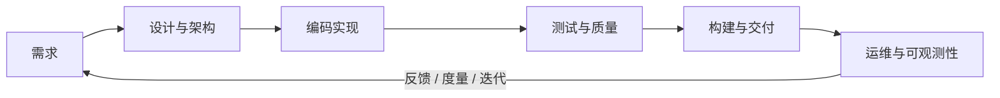

很多人写了好几年代码，仍然说不清"软件工程"到底是什么。它绝不只是"写代码"——写代码只是其中一环。软件工程是**用工程化的方法，在成本、时间、质量三者约束下，可持续地交付并演进软件系统**的一整套学问和实践。

这篇文章想干两件事：一是把软件工程的完整范围拆开讲清楚；二是把它组织成一份**面向在职工程师**的学习大纲——不追求学院式的完整覆盖，而是结合日常工作，能自学、能马上用、按优先级分阶段推进。

## 先建立全局地图

如果把交付一个软件系统的完整生命周期画出来，大致是这样一条链路：

贯穿这条链路的还有两条"隐线"：**软件过程与项目管理**（怎么组织人和节奏）、**协作与工程文化**（怎么让一群人高效共事）。再加上一条元能力：**工程经济与度量**（怎么判断值不值得做、做得好不好）。

下面按模块展开。每个模块给出：核心知识点、推荐深入方向、以及给在职工程师的实践建议。

## 模块一：需求工程

写错的代码可以改，做错的需求会浪费整个迭代。需求是所有工作的源头。

**核心知识点**
- 需求的层次：业务目标 → 用户需求 → 功能需求 → 非功能需求（性能、安全、可用性、合规）。
- 需求获取：访谈、观察、原型验证、数据分析；区分"用户说想要的"和"用户真正需要的"。
- 需求表达：用户故事（User Story）、验收标准（Acceptance Criteria）、用例、场景。
- 需求管理：优先级排序、范围控制（防止 scope creep）、变更管理。

**推荐深入方向**
- 领域驱动设计（DDD）里的通用语言与限界上下文，帮助你把业务语言翻译成模型。
- 用"影响地图 / 用户故事地图"把需求和业务目标对齐。

**给在职工程师的建议**：拿到任务先别急着写。花十分钟问清楚"这个功能要解决谁的什么问题、怎么算做完"，往往比多写两小时代码更值钱。养成写清楚验收标准的习惯。

## 模块二：软件设计与架构

同样的需求，好设计和坏设计的维护成本能差一个数量级。

**核心知识点**
- 设计原则：SOLID、KISS、DRY、YAGNI、高内聚低耦合、关注点分离。
- 设计模式：创建型 / 结构型 / 行为型，重点是理解"它解决什么问题"，而不是背名字。
- 架构风格：分层架构、六边形 / 整洁架构、微服务、事件驱动、CQRS、单体优先（Monolith First）。
- 数据设计：关系模型与范式、NoSQL 取舍、一致性模型、缓存策略。
- 跨切面关注点：鉴权、日志、幂等、限流、重试、容错。

**推荐深入方向**
- 架构权衡分析：学会用"质量属性场景"表达非功能需求，用 ADR（架构决策记录）留痕。
- 分布式系统基础：CAP、最终一致性、幂等与去重、分布式事务的替代方案（Saga、Outbox）。

**给在职工程师的建议**：从"能读懂并改动现有架构"起步，再谈"设计新系统"。每做一个重要技术选型，写一段 ADR 记录"为什么这么选、放弃了什么"，半年后回看会感谢自己。

## 模块三：编码与实现

这是大多数人最熟悉、却最容易停留在"能跑就行"的地方。

**核心知识点**
- 至少一门语言的深入掌握：内存模型、并发模型、错误处理、标准库。
- 数据结构与算法：不为刷题，而为在真实场景选对结构、判断复杂度。
- 代码质量：命名、函数粒度、注释的取舍、可读性优先于炫技。
- 重构：识别坏味道（Code Smell），在测试保护下小步重构。
- 版本控制：Git 的分支模型、rebase 与 merge 的取舍、原子提交、清晰的提交信息。

**推荐深入方向**
- 并发与异步编程：线程 / 协程 / 事件循环模型，以及各自的坑。
- 阅读优秀开源项目源码，模仿其工程结构和抽象方式。

**给在职工程师的建议**：把"写出别人能维护的代码"当成标准，而不是"我能看懂就行"。Code Review 里别人的每一条意见都是免费的成长机会。

## 模块四：测试与质量保障

测试不是写完代码后的附加动作，而是设计的一部分。

**核心知识点**
- 测试金字塔：单元测试为基座、集成测试居中、端到端测试为尖顶。
- 测试类型：单元、集成、契约、端到端、性能、安全、回归。
- 测试驱动：TDD 的节奏（红-绿-重构）、测试替身（mock / stub / fake）。
- 质量门禁：覆盖率的正确用法（关注未覆盖的关键路径，而非盲目追求百分比）、静态分析、Lint。

**推荐深入方向**
- 契约测试（Contract Testing）在微服务间防止接口漂移。
- 属性测试（Property-based Testing）、变异测试（Mutation Testing）衡量测试的有效性。

**给在职工程师的建议**：从"给你正在改的这段逻辑补一个单元测试"开始。哪怕遗留系统没有测试，你新加的代码可以有。测试是你重构和快速迭代的底气。

## 模块五：构建与交付（DevOps / CI-CD）

代码写完只是开始，如何可靠、可重复地把它送到用户手里，是一门独立的工程。

**核心知识点**
- 构建：依赖管理、可重现构建、制品（artifact）管理、版本号策略（语义化版本）。
- 持续集成（CI）：每次提交自动构建 + 测试 + 静态检查，快速反馈。
- 持续交付 / 部署（CD）：环境分层、部署策略（蓝绿、金丝雀、滚动）、回滚机制。
- 基础设施即代码（IaC）：用声明式配置管理环境，让环境可版本化、可复现。
- 容器与编排：容器镜像原理、编排调度的基本概念。

**推荐深入方向**
- 供应链安全：依赖漏洞扫描、制品签名、SBOM。
- 渐进式交付与特性开关（Feature Flag），把"发布"和"上线"解耦。

**给在职工程师的建议**：搞懂你所在团队的流水线每一步在干什么。能自己动手改一段 CI 配置、加一个检查步骤，就已经超过很多只会点"合并"按钮的人。

## 模块六：运维与可观测性

系统上线后才是它生命的开始。看不见的系统，就是失控的系统。

**核心知识点**
- 可观测性三大支柱：日志（Logs）、指标（Metrics）、链路追踪（Traces）。
- 监控与告警：SLI / SLO / 错误预算，避免"告警疲劳"。
- 故障处理：事故响应流程、无指责复盘（Blameless Postmortem）、根因分析。
- 容量与性能：压测、性能剖析（profiling）、瓶颈定位。
- 可靠性设计：优雅降级、熔断、限流、超时与重试的正确姿势。

**推荐深入方向**
- SRE 方法论：用 SLO 和错误预算量化可靠性、平衡稳定与迭代速度。
- 混沌工程：主动注入故障，验证系统韧性。

**给在职工程师的建议**：出线上问题时别只顾着"救火"，事后一定要复盘并把改进落成行动项。学会看监控面板、读日志、查链路，是排障效率的分水岭。

## 模块七：软件过程与项目管理

一个人的效率靠技术，一群人的效率靠过程。

**核心知识点**
- 过程模型：瀑布、迭代、敏捷（Scrum / Kanban）、它们各自适合什么场景。
- 迭代实践：Backlog 管理、估算、站会、回顾会的真正目的。
- 项目约束：范围、时间、成本、质量四者的权衡（不可能全都要）。
- 风险管理：识别、评估、应对、监控。

**推荐深入方向**
- 精益（Lean）与价值流分析，识别并消除交付链路上的浪费。
- 流动效率 vs 资源效率，理解为什么"人人都忙"不等于"交付快"。

**给在职工程师的建议**：别把敏捷仪式当成负担走过场。理解每个环节要解决什么问题，你就能在团队里推动它变得更有效，而不是抱怨它。

## 模块八：软件工程经济与度量

工程师终究要回答一个问题：这件事值不值得做、做得好不好？

**核心知识点**
- 技术债：识别、量化、有计划地偿还，而不是无视或过度重构。
- 权衡决策：构建 vs 购买、现在做 vs 以后做、通用 vs 专用。
- 交付度量：DORA 四项指标（部署频率、变更前置时间、变更失败率、恢复时间）。
- 成本意识：云资源成本、人力成本、机会成本。

**推荐深入方向**
- 用 DORA / SPACE 框架衡量团队研发效能，避免用"代码行数""提交数"这类误导性指标。

**给在职工程师的建议**：学会用"投入产出"和"风险"的语言和非技术同事对话。能把技术决策翻译成业务影响的工程师，晋升往往更快。

## 模块九：协作与工程文化

软件是人写的，工程效率的上限往往由协作质量决定。

**核心知识点**
- 代码评审：如何给出有建设性的评审意见、如何坦然接受意见。
- 文档：README、设计文档、ADR、Runbook，写"未来的自己和同事看得懂"的文档。
- 沟通：异步沟通、把问题描述清楚（提问的智慧）、写清晰的工单和 PR 描述。
- 知识沉淀：把重复踩的坑记录下来，形成团队资产。

**推荐深入方向**
- 建立轻量的工程规范（编码规范、分支规范、评审规范）并让工具自动化执行。

**给在职工程师的建议**：养成"把踩过的坑写下来"的习惯——无论是内部 Wiki 还是个人博客。这既是团队资产，也是你个人影响力的复利。

## 模块十：安全与合规（贯穿始终）

安全不是一个独立阶段，而是渗透在每个模块里的横切关注点。

**核心知识点**
- 安全基础：认证与授权、最小权限、敏感数据加密与脱敏。
- 常见风险：注入、越权、XSS、CSRF、路径穿越、密钥泄露（参见 OWASP Top 10）。
- 安全左移：在设计和编码阶段就考虑安全，而不是上线前补丁。
- 隐私与合规：数据分级、留存策略、脱敏，理解所在行业的合规约束。

**给在职工程师的建议**：至少把 OWASP Top 10 通读一遍，并对照自己的项目自查。不要把任何密钥、真实凭据写进代码或提交历史。

## 把它变成可执行的学习路线

知道范围之后，关键是**按优先级分阶段**，别想着一口气吃成胖子。以下路线假设你已经能写代码、有在职工作场景可以练手。

### 第一阶段（0-3 个月）：夯实日常内功

优先补齐每天都在用、却常常将就的能力：

- **编码与实现**：把主力语言吃透一层，练重构。
- **测试与质量**：给自己正在改的代码补单元测试，理解测试金字塔。
- **版本控制与协作**：把 Git 用熟，写清晰的提交和 PR，认真做 Code Review。

判断标准：你交付的代码，别人能轻松读懂、放心修改。

### 第二阶段（3-9 个月）：从"写功能"到"交付系统"

- **设计与架构**：读懂现有架构，学会用 ADR 记录决策；掌握核心设计原则。
- **构建与交付**：搞懂团队 CI/CD 流水线，能动手改进它。
- **可观测性**：会看监控、读日志、查链路，能独立排障。

判断标准：你能独立负责一个模块的从设计到上线到运维的完整闭环。

### 第三阶段（9 个月以上）：从"交付"到"决策与影响"

- **架构与分布式系统**：能设计新系统，处理一致性、可靠性等硬问题。
- **过程与项目管理**：能推动团队流程改进。
- **工程经济与度量**：能用投入产出和风险的语言参与技术决策，用 DORA 等指标衡量效能。

判断标准：你的判断开始影响团队而不只是自己的一亩三分地。

### 贯穿全程的两件事

- **安全**：每个阶段都带着安全视角看自己的代码和系统。
- **知识沉淀**：持续记录踩过的坑和学到的东西，复利效应会在一两年后显现。

## 学习方法上的几点提醒

- **以战养战**：优先学能马上用在当前工作上的东西，学完立刻实践，否则很快遗忘。
- **深度优先于广度**：与其十个概念都懂皮毛，不如把一个模块打穿，再横向迁移。
- **读源码和读文档**：优秀开源项目和权威文档是免费且高质量的老师。
- **教是最好的学**：把学到的东西讲给别人听、写成文章，是检验是否真懂的试金石。

软件工程的范围很广，但没必要焦虑。它是一门实践的学问——在真实项目里一个模块一个模块地啃，几年下来自然会从"会写代码的人"成长为"能可靠交付系统的工程师"。

## 参考

- [OWASP Top 10](https://owasp.org/www-project-top-ten/)
- [The DORA / DevOps Research and Assessment](https://dora.dev/)
- [Google SRE Book](https://sre.google/books/)
- [Architecture Decision Records (ADR)](https://adr.github.io/)
- [Martin Fowler 的软件工程文集](https://martinfowler.com/)
